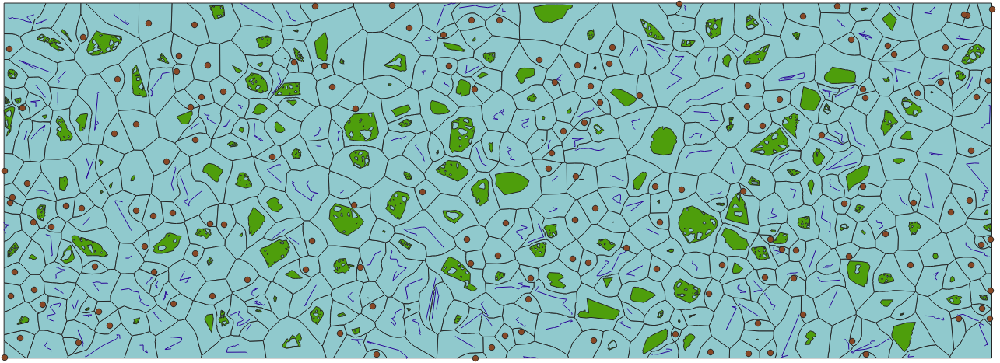

# VoronoiGeom

A library for generating a voronoi diagram from any type of simple geometry



## Usage:

`npm install voronoigeom`

```javascript
const voronoiGeom = require('voronoigeom');

const features = []; // an array of GeoJson Features

const voronoiPolys = voronoiGeom(features);
// an array of GeoJson Polygon Features
```

When passing in multi-geometries, a voronoi polygon is generated for each part of the multi-geom

## Limitations

This does not scale well, seems to work ok for < 500 features
